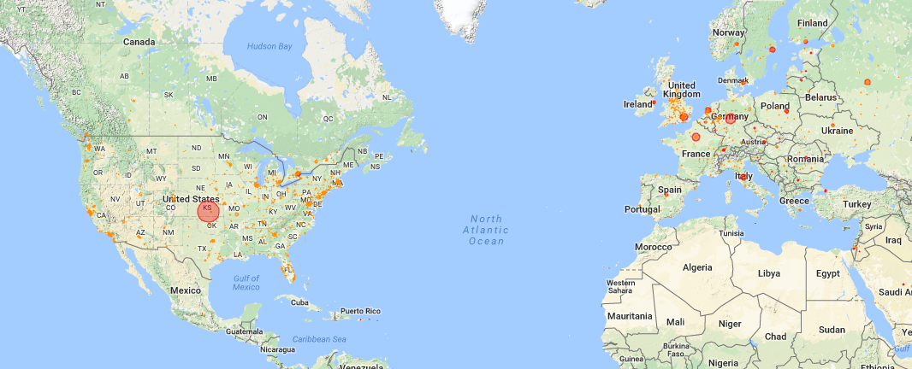

ipmap
=====

This small Python script generates Google Map HTML file with IP distributions.

Installation
------------
No additional installation required for the script.   However, you need to download the GeoLite City database from MaxMind: http://dev.maxmind.com/geoip/legacy/geolite/  Go there, and download "GeoLite City" database in CSV format.  You may need to uncompress it.  Then, you will have `GeoLiteCity-Blocks.csv` and `GeoLiteCity-Location.csv` which are required to run this script.

Usage
-----

`ipmap` provides several options for the customization.  Run with `--help` for more:

        Generate Google map HTML file for unique IP distribution
        Usage: %s [OPTION...] INPUT OUTPUT [CSV-OUTPUT]

           -k, --key=KEY              Set Google Map API key

           -s, --scale=SCALE          Set scale factor of circles (default: 100)
           -L, --loc-database=DB      Set pathname of Locations database (default: ./GeoLiteCity-Location.csv)
           -B, --blk-database=DB      Set pathname of Blocks database (default: ./GeoLiteCity-Blocks.csv)

           -t, --title=TITLE          Set TITLE of the generated map 
           -z, --zoom=ZOOM            Set zoom factor of the generated map (default: 4)

           -a, --latitude=LAT         Set the center location of the map (default: 47.6026)
           -l, --longitude=LNG        Set the center location of the map (default: -122.3284)

           -c, --color=COLOR          Set the color of the circles (default: #FF8C00)
           -u, --unknown-color=COLOR  Set the color of the circles for the unknown locations (default: #FF0000)

               --progress             Enable progress bar

               --help                 Show help message and exit
               --version              Display version information and exit

               --debug                Enable debug output

Provide `ipmap` with an input file with each line having IP (version 4) address.   You must provide your own API key with `-k` (or `--key`)   For example, assuming that input.txt contains IP addresses, you may run like this:

        $ head addresses.txt 
        84.154.164.177
        86.20.238.64
        93.133.89.169
        86.172.115.183
        ...
        $ ./ipmap -k YOUR-GOOGLE-MAP-API-KEY addresses.txt out.html

If the GeoLite database files are not in the current directory, you may need to specify the files using `-L` or `-B' options:

        $ ./ipmap -k YOUR-GOOGLE-MAP-API-KEY -LGeoLiteCity_20161101/GeoLiteCity-Location.csv -BGeoLiteCity_20161101/GeoLiteCity-Blocks.csv addresses.txt out.html

If you want to just render unique IP addresses, you may use `sort(1)` and `uniq(1)` like this:

        $ sort addresses.txt | uniq | ./ipmap -k YOUR-GOOGLE-MAP-API-KEY - out.html

If the generated circles are too small or large, consider to use `-s` option to adjust the radius.

        $ ./ipmap -k YOUR-GOOGLE-MAP-API-KEY -s 1000 addresses.txt out.html

